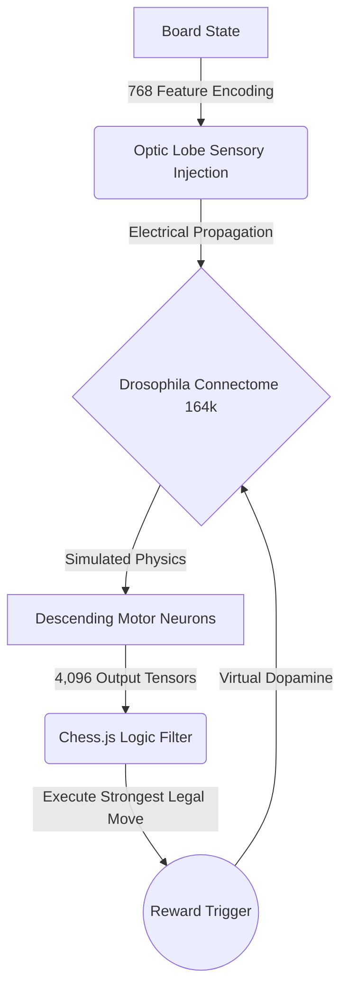

<br/>
<div align="center">
  <a href="#">
    
  </a>

  <h1 align="center">🪰 Drosophila Connectome AI</h1>

  <p align="center">
    <strong>A biological neural network, digitized and trained to play chess.</strong>
    <br/>
    <br/>
    <a href="https://github.com/AdilSiddiquiHQ/fly-connectome-chess/stargazers"></a>
    <a href="https://pytorch.org/"></a>
    <a href="https://threejs.org/"></a>
    <a href="https://opensource.org/licenses/MIT"></a>
  </p>

  <p align="center">
    <i>"The line between biology and computer science has been erased."</i>
  </p>
</div>

---

<details open>
  <summary><b>Table of Contents</b></summary>
  <ol>
    <li><a href="#-the-mad-science">The Mad Science (Backstory)</a></li>
    <li><a href="#-system-architecture">System Architecture</a></li>
    <li><a href="#-how-it-works">How it Works</a></li>
    <li><a href="#-tech-stack">Tech Stack</a></li>
    <li><a href="#-installation--usage">Installation & Usage</a></li>
    <li><a href="#-credits">Credits</a></li>
  </ol>
</details>

---

## 🧬 The Mad Science

In an unprecedented feat of neuroscience, researchers at **Google** and the **Janelia Research Campus** took the physical brain of a fruit fly, stained it with heavy metals, and sliced it with a precision diamond knife into nanometer-thin sheets. Using advanced computer vision, they mapped every single neuron and synapse into a 3D digital schematic (The Connectome).

**This project downloads that exact biological schematic and turns it into an active PyTorch network.**

Instead of building an AI from scratch, we took a biological mind, wired a digital chessboard into its simulated optic nerves, and connected its descending motor neurons to physical chess moves. Using **Dopamine Reinforcement Learning**, we are literally rewiring the biological pathways into a chess engine.

---

## 🏗 System Architecture

The entire pipeline runs locally, bridging a Node/Three.js frontend with a biological PyTorch backend.



---

## ⚙️ How It Works

This project utilizes a standard **Three-Step Biological Bridge** for Connectome manipulation:

<details>
<summary><b>1. Sensory Mapping (The Eyes)</b></summary>
<br>
We map the 768 possible piece-on-square combinations (64 squares × 12 piece types) to a specific cluster of the fly's 8,865 sensory neurons. When a White Knight lands on F3, we inject a <code>1.0</code> voltage spike into that exact neuron. The fly literally <i>feels</i> the board as a high-dimensional electrical pattern.
</details>

<details>
<summary><b>2. Simulated Propagation (The Brain)</b></summary>
<br>
The raw connectome provides the wiring diagram, but not the synaptic strength. We initialize the pathways with baseline weights. As the sensory electricity cascades chaotically through the 164,000 neurons, we simulate games. When the fly makes a good move, a virtual <b>Dopamine Reward</b> triggers, permanently carving exact pathways into the PyTorch tensor matrix.
</details>

<details>
<summary><b>3. Motor Readout (The Muscles)</b></summary>
<br>
The electricity eventually reaches the descending motor neurons (the nerves that normally flap wings). We map these to the 4,096 possible physical chess moves (Start Square ➔ End Square). A logic engine acts as a survival filter, ignoring illegal "twitches" and executing the strongest legal muscle contraction.
</details>

---

## 🛠 Tech Stack

- **PyTorch (`train_fly.py`)**: Runs the massive 164k biological tensor matrix. Hardware accelerated via Apple Silicon `mps`.
- **Flask (`server.py`)**: The nervous system bridge communicating between the brain and the interface.
- **Three.js (`index.html`)**: A hyper-realistic WebGL frontend featuring procedural normal maps, HDRI lighting, and an anatomically correct, glowing 3D particle simulation of the fly's brain (Optic Lobes, Central Brain, Cerebellum).

---

## 🚀 Installation & Usage

Challenge a biological connectome to a game of chess on your own machine.

### Prerequisites
- Python 3.9+
- Git

### 1. Clone & Install
```bash
git clone https://github.com/AdilSiddiquiHQ/fly-connectome-chess.git
cd fly-connectome-chess
pip install -r requirements.txt
```

### 2. Boot the Connectome
Start the Flask server to load the 2,000+ game trained `weights.pt` synaptic memory into RAM.
```bash
python server.py
```

### 3. Initialize the Visualizer
Open your web browser and navigate to:
```text
http://localhost:5050
```
> **Hyper-Bolic Training:** Hit the `+1000 Games` button in the UI if you want to push the fly back into the training loop and carve more dopamine pathways live.

---

## 🔬 Credits
The structural data for the neuron mapping is derived from the open-source work of the **Janelia Research Campus** and **Google Research** via the [FlyWire](https://flywire.ai) project. 

<br>
<div align="center">
  <b>If you found this concept mind-blowing, consider dropping a ⭐ on the repo!</b>
</div>
