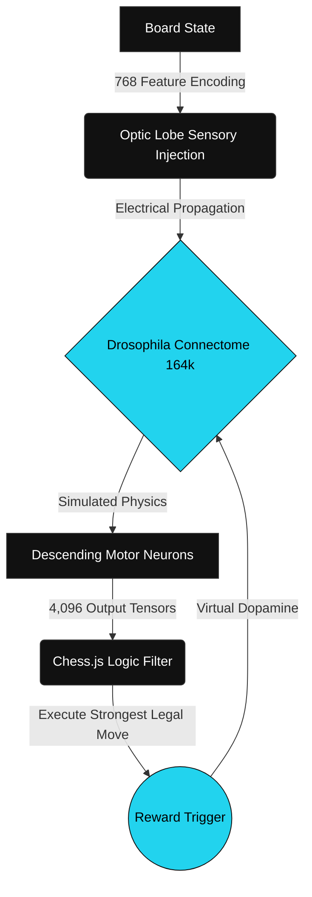

<div align="center">

# 🪰 Drosophila Connectome AI


<p align="center">
  <a href="https://github.com/AdilSiddiquiHQ/fly-connectome-chess/stargazers">
    
  </a>
  <a href="https://pytorch.org/">
    
  </a>
  <a href="https://threejs.org/">
    
  </a>
  <a href="https://opensource.org/licenses/MIT">
    
  </a>
</p>

<blockquote>
  <p align="center">
    <i>The line between biology and computer science has been erased.</i>
  </p>
</blockquote>

<br>

[**Watch the Viral Breakdown**](#) &nbsp; &middot; &nbsp; [**Explore the Connectome**](https://flywire.ai) &nbsp; &middot; &nbsp; [**Quick Start**](#-quick-start)

</div>

<br>

<details>
  <summary><b>📖 Table of Contents</b></summary>
  <ul>
    <li><a href="#-the-mad-science">The Mad Science</a></li>
    <li><a href="#-system-architecture">System Architecture</a></li>
    <li><a href="#-the-biological-bridge">The Biological Bridge</a></li>
    <li><a href="#-tech-stack">Tech Stack</a></li>
    <li><a href="#-quick-start">Quick Start</a></li>
    <li><a href="#-credits">Credits</a></li>
  </ul>
</details>

---

## 🧬 The Mad Science

In an unprecedented feat of neuroscience, researchers at **Google** and the **Janelia Research Campus** took the physical brain of a fruit fly, stained it with heavy metals, and sliced it with a precision diamond knife into nanometer-thin sheets. Using advanced computer vision, they mapped every single neuron and synapse into a 3D digital schematic known as the Connectome.

**This project downloads that exact biological schematic and turns it into an active PyTorch tensor network.**

Instead of building an AI from scratch, we took a biological mind, wired a digital chessboard into its simulated optic nerves, and connected its descending motor neurons to physical chess moves. Using **Dopamine Reinforcement Learning**, we are physically rewiring the biological pathways into a chess engine.

---

## 🏗 System Architecture

The entire pipeline runs locally, bridging a Three.js frontend visualizer with a biological PyTorch backend.



---

## 🔬 The Biological Bridge

This project utilizes a standard **Three-Step Bridge** for connectome manipulation:

<table>
  <tr>
    <td width="50%">
      <h3>👁️ 1. Sensory Mapping</h3>
      We map the 768 possible piece-on-square combinations (64 squares × 12 piece types) to a specific cluster of the fly's 8,865 sensory neurons. When a White Knight lands on F3, we inject a <code>1.0</code> voltage spike into that exact neuron. <b>The fly literally feels the board as a high-dimensional electrical pattern.</b>
    </td>
    <td width="50%">
      <h3>🧠 2. Simulated Propagation</h3>
      The raw connectome provides the wiring diagram, but not synaptic strength. As the sensory electricity cascades chaotically through the 164,000 neurons, we simulate games. When the fly makes a good move, a virtual <b>Dopamine Reward</b> triggers, permanently carving pathways into the PyTorch tensor matrix.
    </td>
  </tr>
  <tr>
    <td colspan="2">
      <h3>💪 3. Motor Readout</h3>
      The electricity eventually reaches the descending motor neurons (the nerves that normally flap wings). We map these to the 4,096 possible physical chess moves (Start Square ➔ End Square). A logic engine acts as a survival filter, ignoring illegal "twitches" and executing the strongest legal muscle contraction.
    </td>
  </tr>
</table>

---

## 🛠 Tech Stack

| Domain | Technology | Purpose |
|:---|:---|:---|
| **Deep Learning** | `PyTorch` | Simulates the 164k neuron matrix (MPS Apple Silicon Accelerated). |
| **Backend API** | `Flask` & `Python 3` | Bridges the browser visualization to the biological tensor calculations. |
| **Frontend UI** | `Three.js` & `WebGL` | Renders the hyper-realistic fly, HDRI board, and glowing 3D particle simulation of the fly's brain (Optic Lobes, Cerebellum). |
| **Logic Filter** | `chess.js` | Filters the chaotic motor neuron output for legal chess moves. |

---

## 🚀 Quick Start

Challenge a biological connectome to a game of chess on your own machine.

### 1. Clone & Install
Requires Python 3.9+ and pip. If you are on an M-Series Mac, PyTorch will automatically use the `mps` hardware acceleration.
```bash
git clone https://github.com/AdilSiddiquiHQ/fly-connectome-chess.git
cd fly-connectome-chess
pip install -r requirements.txt
```

### 2. Boot the Connectome
Start the Flask server to load the 2,000+ game trained `weights.pt` synaptic memory into RAM.
```bash
python server.py
```

### 3. Initialize the Visualizer
Open your web browser and navigate to `http://localhost:5050`.

> **Hyper-Bolic Training:** Hit the `+1000 Games` button in the UI if you want to push the fly back into the training loop and carve more dopamine pathways live.

---

## 🏆 Credits
The structural data for the neuron mapping is derived from the open-source work of the **Janelia Research Campus** and **Google Research** via the [FlyWire](https://flywire.ai) project. 

<br>
<div align="center">
  <b>If you found this concept mind-blowing, consider dropping a ⭐ on the repo!</b>
</div>
